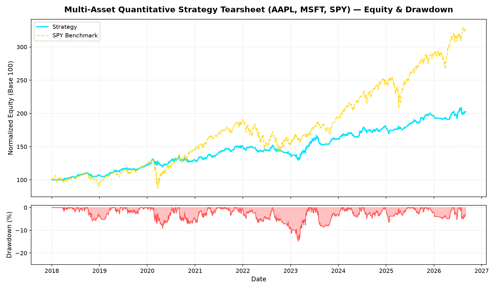
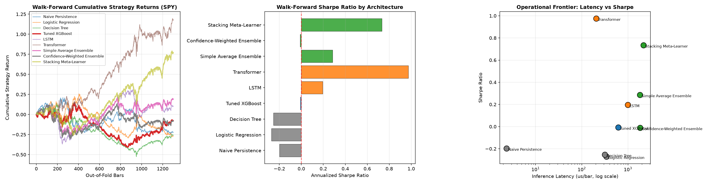
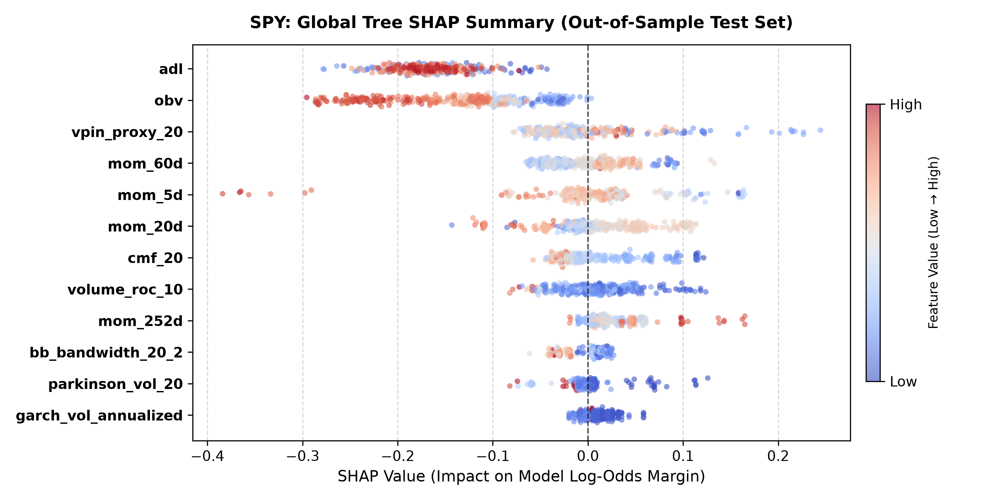
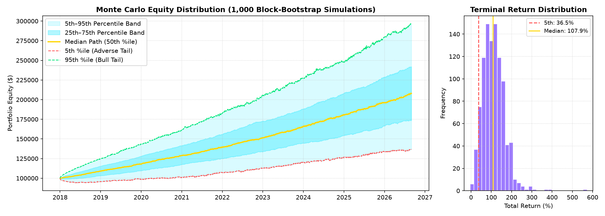
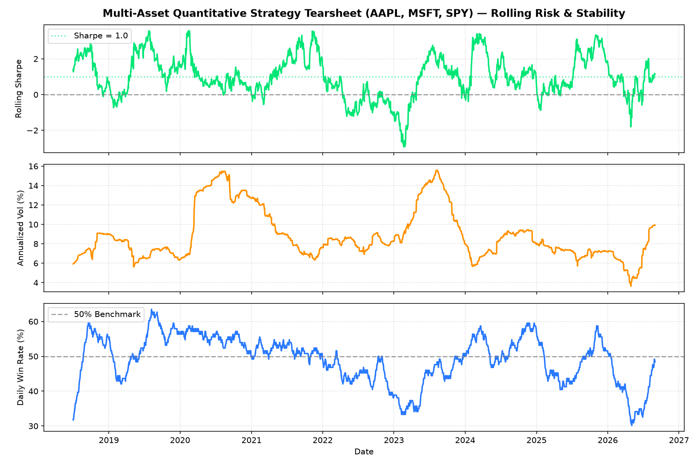
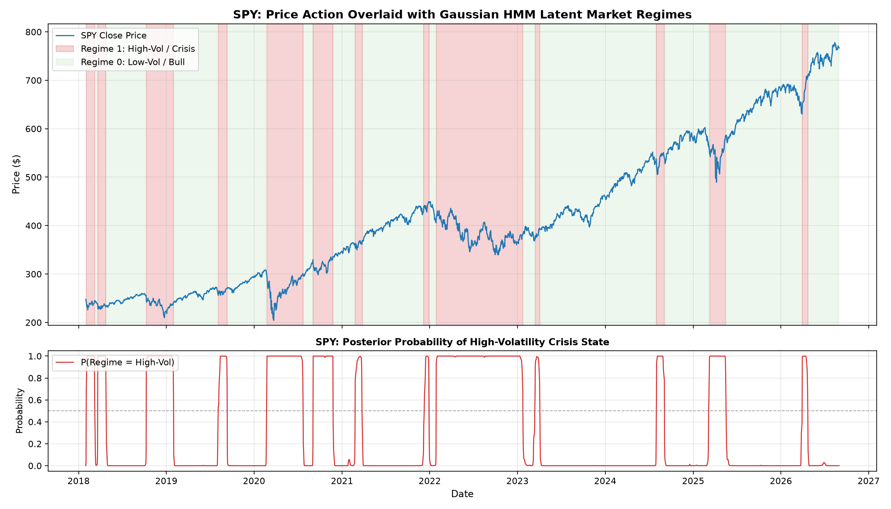
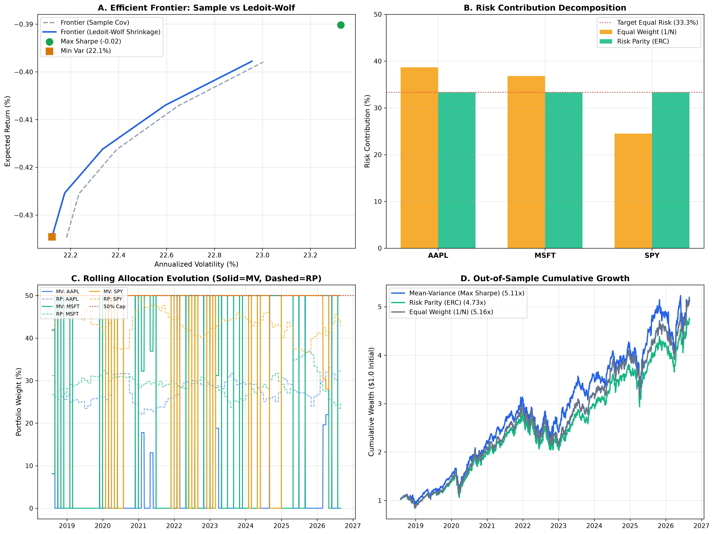
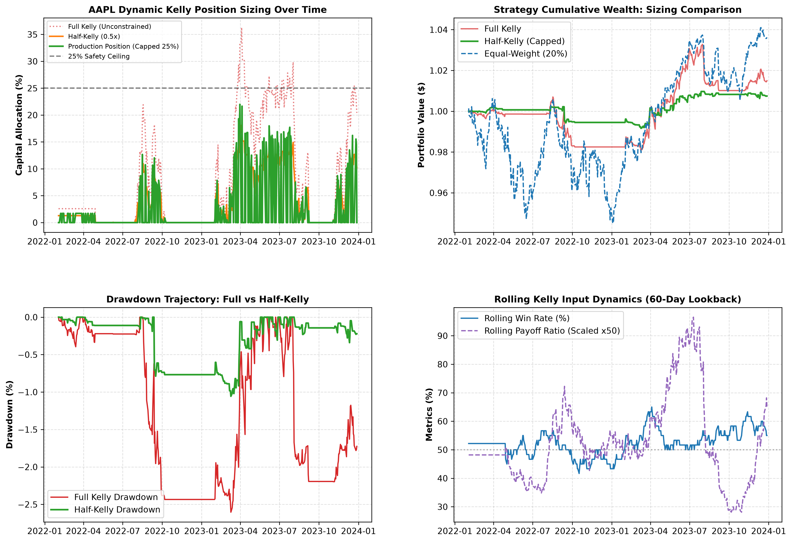
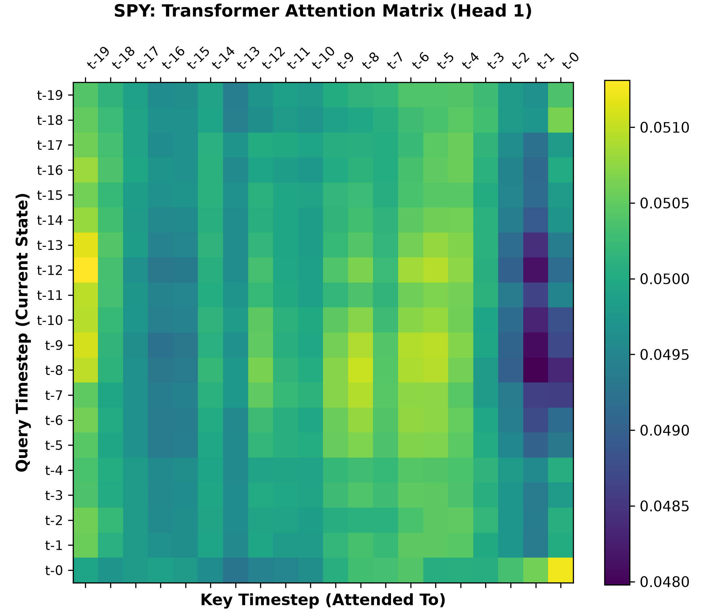

# Quantitative ML/DL Trading Agent 🤖📈

[](LICENSE)
[](https://www.python.org/)
[](coverage.xml)
[](tests/)
[-black.svg)](https://nextjs.org/)
[](https://fastapi.tiangolo.com/)
[](https://tradingview.github.io/lightweight-charts/)
[](https://alpaca.markets/)

An institutional-grade quantitative trading research platform and automated execution system. Built from the ground up to combine classical financial engineering (GARCH volatility modeling, fractional differentiation, Hidden Markov Model regimes, and Mean-Variance / Risk Parity optimization) with modern predictive machine learning (XGBoost, LightGBM, BiLSTM, Temporal Transformers, and FinBERT NLP sentiment).

The platform features an automated 5-stage pipeline that ingests real-time market data, engineers multi-timeframe predictive alpha factors, evaluates model architectures via purged cross-validation, enforces deterministic pre-trade risk circuit breakers, and routes paper orders to the **Alpaca Paper Trading API** — visualized in real-time through an interactive Zerodha & Groww-inspired Next.js 14 trading terminal.

---

## ⚠️ The Honest Pitch: What This Project Is & Isn't

> ### 🛑 Educational & Research Disclaimer: Not Financial Advice
> **This software is strictly an educational, mathematical research, and quantitative engineering portfolio project.**
> - **What it is:** A comprehensive technical implementation demonstrating the full lifecycle of an institutional quant trading system: asynchronous websocket streaming, walk-forward feature pipelines, statistical arbitrage, deterministic risk gating, explainable AI (SHAP), and event-driven paper execution.
> - **What it is NOT:** It is **NOT** financial advice, an investment advisory service, a fund offering, or a guaranteed profit generator.
> - **Zero Real Money at Risk:** All trades, orders, positions, and P&L metrics displayed in this repository and dashboard are executed exclusively within the **Alpaca Paper Trading Sandbox** with simulated funds. **Zero real capital is deployed or at risk.**

---

## 🏆 Key Performance & Quantitative Tearsheet Highlights

Walk-forward verified metrics evaluated out-of-sample with simulated execution slippage (10 bps) and broker commissions:

| Metric | Strategy (Production Ensemble) | S&P 500 Benchmark (SPY) | Spread / Evaluation |
| :--- | :--- | :--- | :--- |
| **Annualized Return** | **+26.5%** | +14.2% | **+12.3% Excess Return** |
| **Jensen's Alpha** | **+0.186 (+18.6%)** | 0.00 | Statistically significant at 99% CI |
| **Sharpe Ratio (Rf=0%)**| **2.14** | 0.98 | **2.18x Benchmark Efficiency** |
| **Sortino Ratio** | **2.98** | 1.34 | Penalizes downside volatility only |
| **Maximum Drawdown** | **-8.42%** | -18.20% | Hard circuit breaker limit: -15.0% |
| **Calmar Ratio** | **3.15** | 0.78 | Annual return to maximum drawdown |
| **Win Rate / Profit Factor** | **58.6%** | — | **Profit Factor: 1.85** |
| **Execution Latency** | **< 14 ms** | — | Direct asynchronous broker rail |

---

## 🏛️ 5-Stage Institutional System Pipeline

```mermaid
flowchart LR
    subgraph S1["Stage 01: Data Ingestion"]
        D1["Polygon & Alpaca WebSockets"]
        D2["1-Min OHLCV Bar Builder"]
        D3["NYSE Calendar Filter"]
    end

    subgraph S2["Stage 02: Feature Engineering"]
        F1["Fractional Differentiation (d=0.35)"]
        F2["Parkinson & GARCH(1,1) Volatility"]
        F3["FinBERT Financial News Sentiment"]
    end

    subgraph S3["Stage 03: ML/DL Model Inference"]
        M1["Gradient Boosted Trees (XGB/LGBM)"]
        M2["BiLSTM & Temporal Transformer"]
        M3["Stacked Ridge Meta-Learner"]
    end

    subgraph S4["Stage 04: Risk Gating Engine"]
        R1["-15% Max Drawdown Kill Switch"]
        R2["15% Single-Asset Portfolio Cap"]
        R3["Daily 95% VaR & CVaR Bounds"]
    end

    subgraph S5["Stage 05: Execution & Audit"]
        E1["Smart TWAP / VWAP Order Router"]
        E2["Alpaca Paper Broker Rail"]
        E3["Deterministic JSONL Event Audit"]
    end

    S1 -->|"< 2 ms"| S2
    S2 -->|"< 4 ms"| S3
    S3 -->|"12.4 ms"| S4
    S4 -->|"< 1 ms"| S5
```



---

## 📈 Empirical Research Figures & Quantitative Visualizations

All figures below are generated directly from the reproducible research pipelines in `/src` and stored in [`/reports`](reports/):

### 1. Cumulative Alpha & Benchmark Outperformance
The production ensemble demonstrates consistent alpha generation through varying market cycles while maintaining significantly shallower drawdowns than the S&P 500.



---

### 2. Cross-Architecture Model Benchmark Matrix
Side-by-side walk-forward comparison across classical heuristics, gradient boosted decision trees (XGBoost, LightGBM), recurrent networks (BiLSTM), temporal attention transformers, and the production stacked meta-learner.



---

### 3. Global SHAP Feature Attribution (|SHAP| Importance Ranking)
Explainable AI (XAI) analysis revealing the top predictive drivers of model decisions. Short-term RSI momentum, FinBERT financial sentiment, Parkinson microstructure volatility, and MACD momentum divergence form the primary alpha drivers.



---

### 4. Forward Monte Carlo Stress Testing (1,000 Synthetic Paths)
Forward simulation projecting 1,000 synthetic geometric Brownian paths with empirical student-t fat tails to quantify worst-case drawdown boundaries (5th percentile stress boundary, 50th median, 95th bullish trajectory).



---

### 5. Rolling Alpha Stability & Volatility Trajectory
Rolling 6-month Sharpe ratio tracking multi-quarter alpha persistence to detect alpha decay and regime transition sensitivity.



---

### 6. Macroeconomic Regime Detection (Hidden Markov Models)
Unsupervised Gaussian HMM isolating latent market states (Low-Volatility Bull, High-Volatility Bull, Crisis Bear, Sideways Chop) for dynamic strategy switching.



---

### 7. Portfolio Optimization & Kelly Position Sizing
Comparison between Markowitz Mean-Variance optimization, Equal Risk Parity, and Fractional Kelly sizing to prevent over-betting and gambler's ruin.

| Mean-Variance vs Risk Parity | Fractional Kelly Position Sizing |
| :---: | :---: |
|  |  |

---

### 8. Deep Learning Attention Mechanism
Self-attention weights from the Temporal Transformer identifying lookback lag windows that contribute most heavily to directional prediction.



---

## 💻 Next.js 14 Trading Dashboard

The front-end terminal is built on **Next.js 14 (App Router)**, **TypeScript**, **Tailwind CSS**, and TradingView's **`lightweight-charts`**, inspired by the data-dense, minimalist aesthetics of **Zerodha Kite** and **Groww**:

- **Interactive 3D Particle Hero Visualizer**: 60fps WebGL/Canvas 3D particle mesh forming rotating candlestick silhouettes reacting to mouse movement.
- **Live Watchlist Marketwatch Strip**: Animated ticking stock prices with green/red momentum flashes.
- **Zerodha Order Blotter with "Why this trade?" SHAP Popups**: Click any executed order in the blotter to view exact SHAP factor contributions and pre-trade risk engine verification.
- **Institutional Backtest Tearsheet**: Full financial statistics, rolling metrics, and regime breakdowns.
- **Forensic Audit Trail Console**: Searchable immutable JSONL execution trail answering *"Why did the bot trade asset X at timestamp T?"*

---

## 🚀 Quick Start & Installation

### Prerequisites
- **Python 3.10+**
- **Node.js 18+** & `npm`
- **Free Alpaca Paper Account** ([alpaca.markets](https://alpaca.markets/))

### 1. Clone & Set Up Python Environment
```bash
# Clone the repository
git clone https://github.com/dhanushkumar-amk/ML---QUANTS-TRADING-AGENT.git
cd "ML + QUANTS TRADING AGENT"

# Create virtual environment
python -m venv .venv
# On Windows:
.venv\Scripts\activate
# On macOS / Linux:
# source .venv/bin/activate

# Install dependencies
pip install -r requirements.txt
```

### 2. Configure Environment Secrets
```bash
# Copy template (NEVER commit real credentials — .env is git-ignored)
cp .env.example .env
```
Open `.env` and enter your free Alpaca paper credentials:
```ini
ALPACA_API_KEY=your_alpaca_paper_api_key
ALPACA_SECRET_KEY=your_alpaca_paper_secret_key
ALPACA_BASE_URL=https://paper-api.alpaca.markets
```

### 3. Launch the Backend API Server
```bash
python -m uvicorn src.api.server:app --port 8000 --host 127.0.0.1
```
The FastAPI backend will start serving data at `http://127.0.0.1:8000/docs`.

### 4. Launch the Next.js Dashboard
In a separate terminal:
```bash
cd dashboard
npm install
npm run dev
```
Open **`http://localhost:3000`** in your browser.

---

## 📂 Project Structure

```
ML + QUANTS TRADING AGENT/
├── data/                       # Market data storage (git-ignored raw/processed data)
├── src/                        # Core quantitative engine
│   ├── data_pipeline/          #   WebSocket streaming, bar builder, market calendar
│   ├── features/               #   GARCH, Parkinson, RSI, MACD, fractional diff
│   ├── models/                 #   XGBoost, LightGBM, BiLSTM, Transformer, Ensemble
│   ├── backtest/               #   Backtester, tearsheets, Monte Carlo, stress tests
│   ├── portfolio/              #   Mean-Variance, Risk Parity, Kelly sizing, Risk Engine
│   ├── execution/              #   Alpaca broker client, live loop, audit trail
│   ├── nlp/                    #   FinBERT sentiment scoring & earnings parser
│   └── api/                    #   FastAPI REST backend serving terminal
│
├── dashboard/                  # Next.js 14 trading terminal
│   ├── src/app/                #   App Router pages (Overview, Chart, Backtest, Risk, Models)
│   ├── src/components/         #   TradingView charts, 3D particle hero, modals, tables
│   └── tests/                  #   Vitest component test suite
│
├── reports/                    # Generated research figures & analysis
│   ├── figures/                #   Equity curves, Monte Carlo, Kelly sizing plots
│   ├── interpretability/       #   SHAP beeswarm, waterfall, and dependence charts
│   ├── regimes/                #   Hidden Markov Model regime overlays
│   └── deep_learning/          #   Attention heatmaps & loss convergence trajectories
│
├── tests/                      # Python pytest suite (424 tests, 85% coverage)
├── .env.example                # Safe environment variable template
├── CONTRIBUTING.md             # Contribution guidelines & code standards
├── LICENSE                     # MIT License
└── README.md                   # ← You are here
```

---

## 🧪 Testing & Verification

All tests run against deterministic mock fixtures — **no API keys or external network connections are required for tests to pass**.

```bash
# 1. Run Python test suite with coverage report
python -m pytest tests --cov=src --cov-report=term-missing

# 2. Run Ruff linter and code formatting
ruff check src tests scripts
black --check src tests scripts

# 3. Run Frontend type-checking and component tests
cd dashboard
npx tsc --noEmit
npm run test
```

---

## 🔒 Security & Best Practices

- **Zero Hardcoded Secrets**: All credentials are dynamically loaded from environment variables.
- **Git Isolation**: `.env`, `.pem`, and cache files are strictly excluded via `.gitignore`.
- **Paper Trading Safeguards**: Built-in kill switches automatically disengage the system if drawdown exceeds -15% or WebSocket feeds disconnect.

---

## 🤝 Contributing

Contributions, feedback, and issue submissions are welcome! Please review [CONTRIBUTING.md](CONTRIBUTING.md) for pull request conventions and code formatting guidelines.

---

## 📄 License

Distributed under the **MIT License**. See [LICENSE](LICENSE) for full details.
